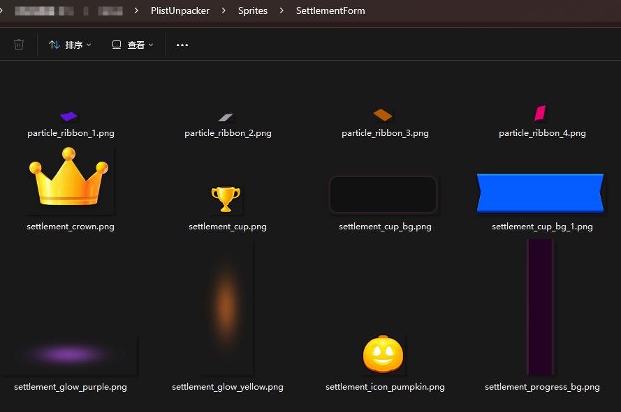

**TextureUnpacker**  

Based on Unity 2018.2.11f1  

1、copy plist&png to Resources folder

2、select plist&png file

3、right click mouse，you will see 

1、Plist to Atlas:   
    make the png to a spritealtas for unity use.

2、Plist to png(file):   
    split the big png to small pieces( saved in Project_Root/Sprites/)

3、Atlas to png(file):   
    split the unity atlas to small pieces( saved in Project_Root/Sprites/)

